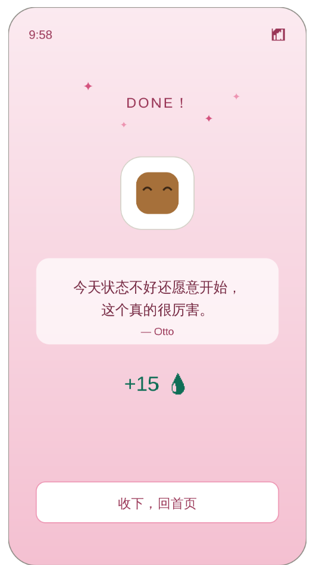

# anchor-beta

anchor-beta 是一个硬件联动的专注启动器：把手机放到 Dock 上，网页自动进入全屏专注倒计时；完成一个小任务后，网页给出鼓励和休息流程，同时向 ESP32 发送祝贺提示。

项目由三部分组成：

- `software/`：React 前端 + Node.js API/WebSocket 后端
- `hardware/micropython/`：ESP32 MicroPython 固件与传感器测试脚本
- `docs/`：演示视频、截图、硬件说明和展示页

## 演示

> GitHub README 想直接显示视频播放器时，需要把 `.mp4` 上传到 GitHub 的 Markdown 编辑器，得到 `https://github.com/user-attachments/assets/...` 形式的视频地址，再把该地址单独放在这里。仓库内的本地 `.mp4` 保留为完整演示文件，具体步骤见 [docs/github-readme-video.md](docs/github-readme-video.md)。

[](docs/demo/anchor-beta-demo-2026-05-24.mp4)

完整演示视频：[docs/demo/anchor-beta-demo-2026-05-24.mp4](docs/demo/anchor-beta-demo-2026-05-24.mp4)

关键页面截图：




## 核心功能

- AI 整理思绪：把零散输入拆成可执行的小任务。
- 硬件触发专注：手机放到 Dock 后，ESP32 发送 `{"sig":"start"}`，网页进入全屏倒计时。
- 25 分钟默认专注：硬件启动时会自动选取当前待办或创建默认专注任务。
- 小任务完成：触摸/按键触发 `{"sig":"complete"}`，网页标记当前小任务完成。
- 休息与继续：完成后进入鼓励、积分和短休息流程，再回到下一个任务。
- WebSocket 桥接：后端同时连接网页端和 ESP32，负责转发硬件信号与网页命令。

## 项目结构

```text
anchor-beta/
|-- software/
|   |-- frontend-mobile/   # 主演示前端，移动端优先 PWA
|   |-- frontend-web/      # 横屏/桌面演示前端
|   |-- backend/           # Express API + WebSocket hub
|   |-- package.json       # 生产构建与启动脚本
|   `-- railway.json       # 部署配置
|-- hardware/
|   `-- micropython/       # ESP32 固件、VL53L0X 驱动、测试脚本
|-- docs/
|   |-- demo/              # 项目演示视频
|   |-- images/            # README 截图
|   |-- github-readme-video.md
|   |-- hardware-vl53l0x.md
|   |-- anchor-beta-hardware-ppt.html
|   `-- software/frontend.md
|-- LICENSE
|-- CONTRIBUTING.md
`-- README.md
```

## 本地运行

环境要求：

- Node.js 18+
- npm

启动后端：

```bash
cd software/backend
npm install
cp .env.example .env
npm run start
```

启动移动端前端：

```bash
cd software/frontend-mobile
npm install
npm run dev
```

默认情况下，Vite 会把 `/api` 和 `/ws` 代理到 `localhost:3001`。

## 后端环境变量

复制 `software/backend/.env.example` 为 `software/backend/.env`，再填入真实密钥：

```env
PORT=3001
LLM_API_KEY=your_llm_api_key
LLM_BASE_URL=https://api.deepseek.com
LLM_MODEL=deepseek-chat
BAIDU_APPID=your_baidu_appid
BAIDU_APPKEY=your_baidu_appkey
```

不要把真实 API Key、服务器密码、Wi-Fi 密码提交到仓库。

## 硬件说明

当前硬件原型：

- ESP32 开发板
- VL53L0X ToF 距离传感器
- TTP223 触摸模块或等效完成输入
- 可选 OLED 显示屏
- 可选 WS2812 灯环

主要文件：

- `hardware/micropython/main_ws_fixed.py`：完整硬件 + WebSocket 联动固件
- `hardware/micropython/vl53l0x_driver.py`：本项目使用的 VL53L0X 驱动
- `hardware/micropython/distjudge.py`：距离判断测试脚本
- `hardware/micropython/vl53l0x_diag.py`：传感器诊断脚本

上传到 ESP32 时，将 `main_ws_fixed.py` 作为 `main.py` 上传，并同时上传 `vl53l0x_driver.py`。烧录前需要在 `main.py` 中填写 Wi-Fi 和后端地址。

硬件到网页的信号：

```json
{"sig":"start"}
{"sig":"stop"}
{"sig":"complete"}
```

网页到硬件的命令：

```json
{"cmd":"play"}
{"cmd":"congrats","message":"完成啦！"}
{"cmd":"rest","seconds":300}
```

VL53L0X 接线与阈值说明见 [docs/hardware-vl53l0x.md](docs/hardware-vl53l0x.md)。

## 生产部署

`software/` 目录支持后端托管构建后的移动端前端：

```bash
cd software
npm install
npm run build
npm start
```

主要服务：

- `GET /health`
- `POST /api/organize`
- `POST /api/encourage`
- `POST /api/stt`
- `WS /ws/app`
- `WS /ws/device`
- `WS /ws/stt`

## 许可证

本项目使用 anchor-beta Non-Commercial License。允许个人、教育、研究、评估和非商业黑客松演示使用；未经书面许可，禁止商业使用。

详见 [LICENSE](LICENSE)。
